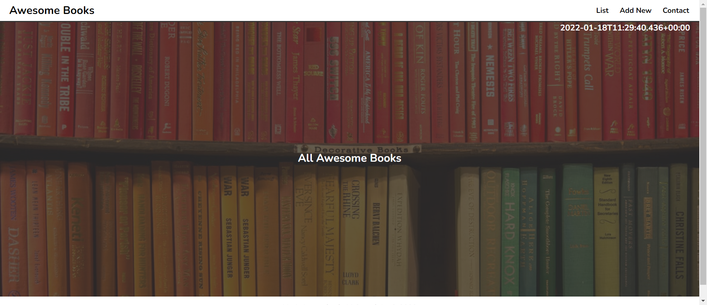
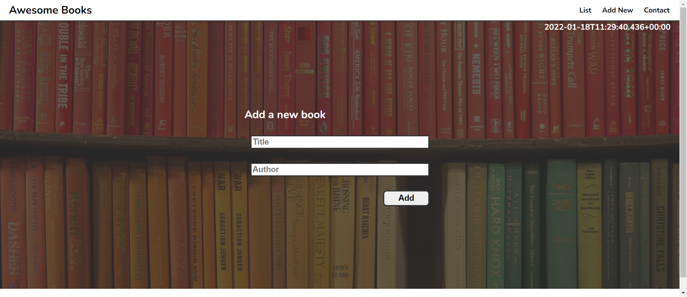
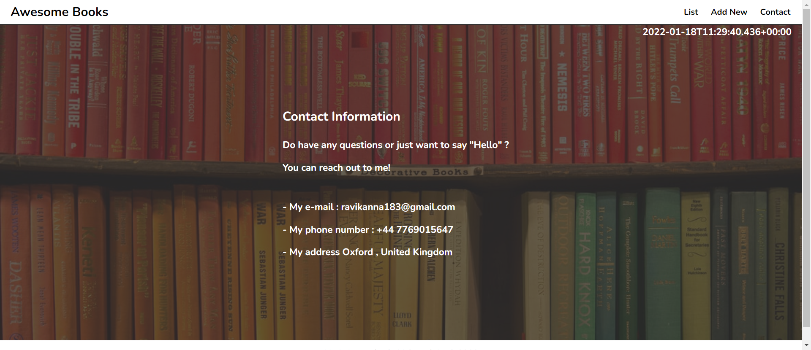

# Awesome_Books
Creation Book List Library for a user to store the list of books 

> A demo website for Book Library.

## Built With

HTML and CSS
Javascript : Arrays and Objects , DOM , Local Storage etc 

## Video

In the following [link](Coming Soon)

## Live Server

In the following link, you can view (Coming Soon)).

## Screenshot

### Getting Started

1. Clone the repository git clone https://github.com/RaviTejaM9602/ES6_Awesome_Books &2. Open terminal and navigate to the downloaded / project folder.
3. Run npm install in the Terminal(Installs the dependency Pakages required).
4. Run the live server or simply open index.html with your browser.

## Project Setup for any Viewer/User reference (To rebuild this project ) :

1. Create a new directory and initialize it with git.
2. Use npm init -y command to create package.json file.
3. Create the entry point for your JavaScript code called index.js
4. Create index.css file for your styles.
5. Create the main index.html file. Link your index.js and index.css files there.
6. Create a directory called modules.
7. Next Install npm install --save luxon. (To get the current date and time.)

 For More Info ...(https://github.com/microverseinc/curriculum-javascript/blob/main/books/books_with_es6.md)

## Authors

👤 **Ravi Teja M**

### Prerequisites
Grid, Flexbox, Images (Concepts in CSS).
HTML5 Semantic Tags

### Setup
Linter Setup

## Authors

👤 **Author1**

- GitHub: [@githubhandle](https://github.com/RaviTejaM9602/Awesome_Books)
- Twitter: [@twitterhandle](https://twitter.com/RaviTejaMekala1)
- LinkedIn: [LinkedIn](https://www.linkedin.com/in/ravi-teja-8499a31b9/)

## 🤝 Contributing

Contributions, issues, and feature requests are welcome!

Feel free to check the [issues page](../../issues/).

## Acknowledgments

- Original design idea by [Microverse](https://github.com/microverseinc/curriculum-javascript/blob/main/books/sneak_peek_v1_1.md).

## Show your support

Give a ⭐️ if you like this project!

## 📝 License

This project is [MIT](./MIT.md) licensed.
Ravi Teja 
